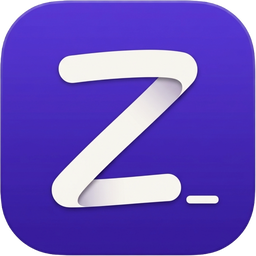
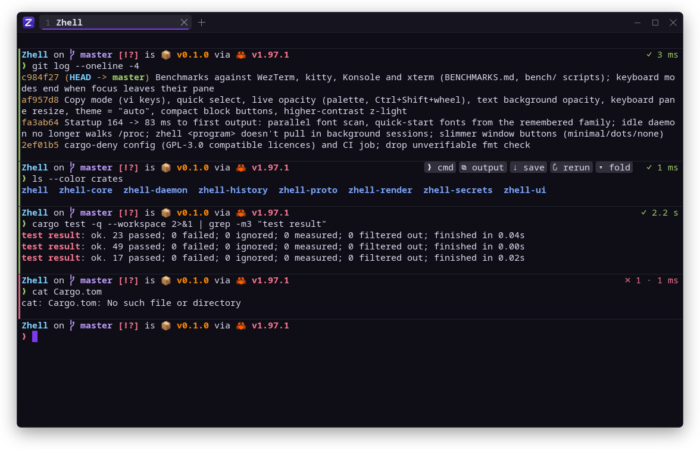
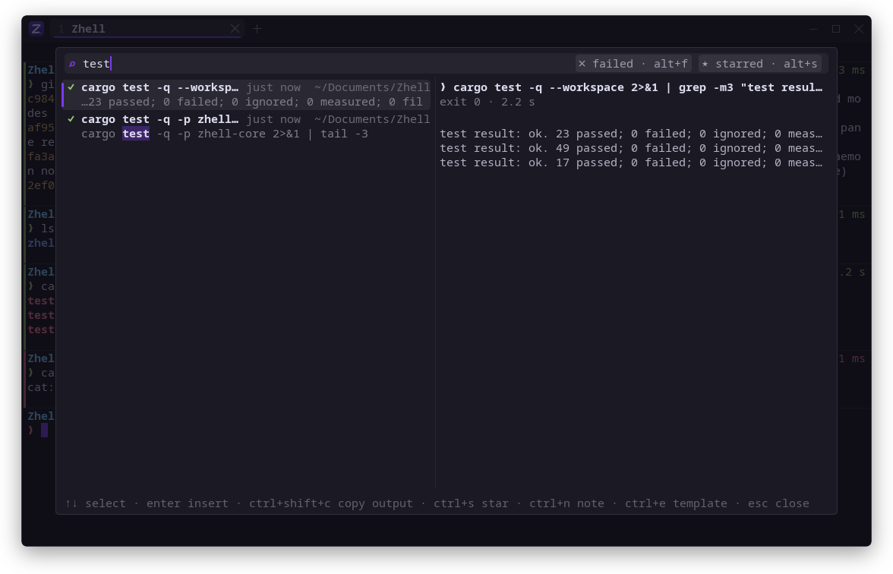
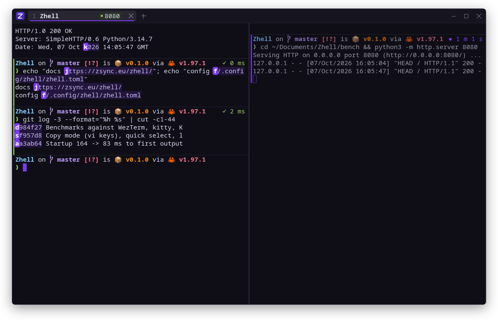
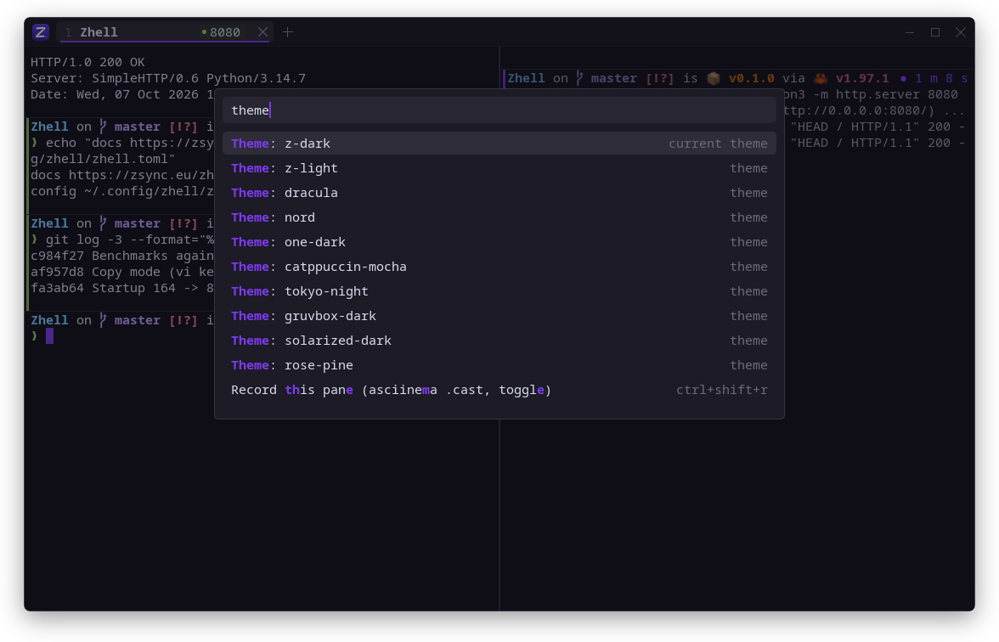
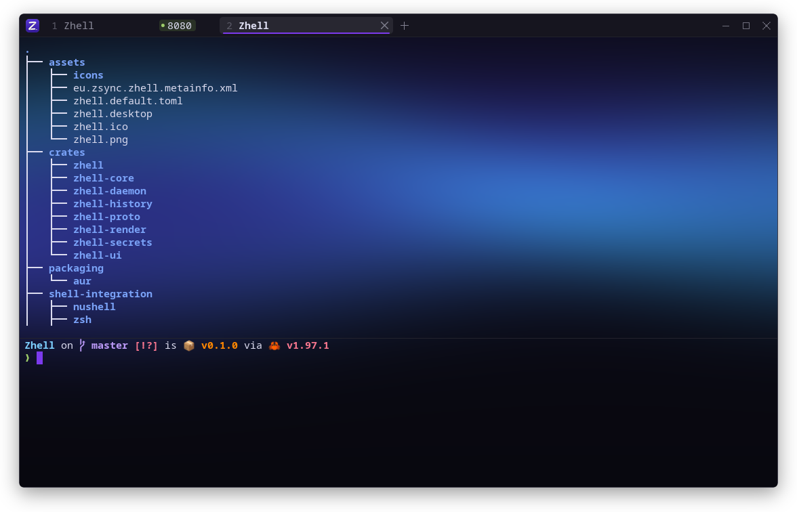
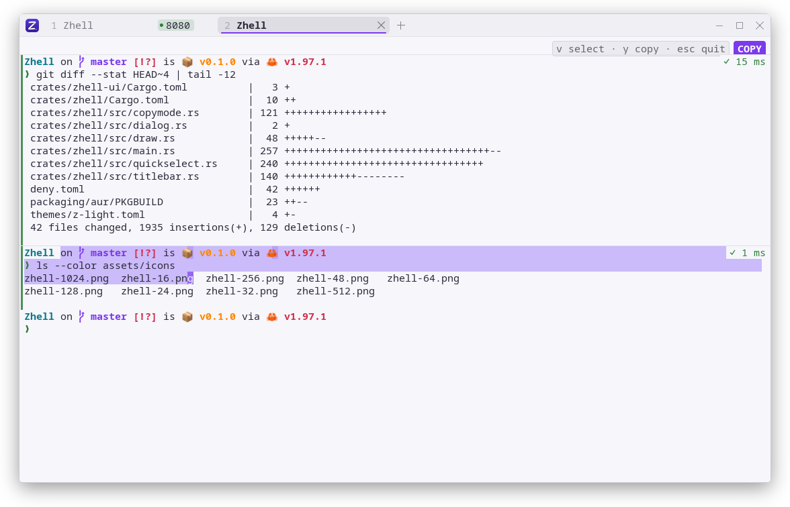

<div align="center">



# Zhell

**The fast GPU terminal that remembers every command and never loses a session.**

A modern, open-source terminal emulator for **Linux** and **Windows**, written in Rust.
Every command becomes a block, everything you ran is searchable, and your shells keep
running when the window closes — no account, no cloud, no telemetry.

<br />

[](#-install)
[](LICENSE)
[](#-how-its-built)
[](BENCHMARKS.md)
[](#-privacy)

<br />

**[🌐 Website](https://zsync.eu/zhell/)** &nbsp;·&nbsp;
**[✨ Features](#-features)** &nbsp;·&nbsp;
**[📸 Screenshots](#-screenshots)** &nbsp;·&nbsp;
**[⚡ Benchmarks](#-performance)** &nbsp;·&nbsp;
**[🚀 Install](#-install)** &nbsp;·&nbsp;
**[⚙️ Configure](#%EF%B8%8F-configure)**

<br />



</div>

---

## 💡 What is Zhell?

Zhell is a **GPU-accelerated terminal emulator** that understands what you're doing in it.
It knows where each command starts and ends, keeps every command *and its output* in a local,
full-text-searchable history, and runs your shells in a small background daemon, so closing
the window, a crash or an update never kills a long build or an SSH session.

It's for people who live in the terminal and want the comfort of tools like Warp — command
blocks, search, a command palette — while keeping the speed, keyboard-first workflow and
privacy of WezTerm, kitty or Alacritty. Zhell is **free and open source (GPL-3.0)**, works
with the shell you already use (bash, zsh, fish, PowerShell, nushell) and never needs an
account or an internet connection.

| | |
|---|---|
| 🧱 **Command blocks** | Every command and its output is a block: exit code, duration, copy, fold, rerun, share. |
| 🔎 **History of everything** | Search every command you ever ran *and what it printed*. Secrets are redacted before saving. |
| ♾️ **Sessions that survive** | Close the window, reboot the GUI, update Zhell — your tabs, splits and running programs come back. |
| ⚡ **Fast** | 13 ms from key press to screen, a usable window in 84 ms, throughput on par with kitty. |
| ⌨️ **Keyboard-first** | Command palette, vim copy mode, quick select for URLs/paths/hashes, splits and tabs without the mouse. |
| 🎨 **Looks like it belongs** | Glass transparency with blur, 10 themes + import, background images and live shader backgrounds. |

---

## ✨ Features

### Work with commands, not just text
- **Command blocks** — with shell integration (loaded automatically, your dotfiles stay
  untouched) each command gets a green or red edge, its exit code and duration, a sticky
  header while you scroll long output, and hover buttons to copy the command, copy the output,
  save it, fold it or rerun it. `Ctrl+↑/↓` jumps between commands.
- **History of everything** — every finished command and its output goes into a local SQLite
  database with full-text search (`Ctrl+Shift+F`). Filter failed commands, star the ones you
  need again, add notes, turn commands into templates with `{{placeholders}}`. Tokens, keys and
  passwords are redacted *before* anything is written; the database can be encrypted with a key
  kept in your system keyring.
- **Share and replay** — save a command as a web page that looks exactly like your terminal,
  record a pane to an asciinema `.cast` file (`Ctrl+Shift+R`).

### Never lose a session
- **Sessions survive** — shells run in the `zhelld` daemon. Close the window, kill it, update
  Zhell: reopen and every tab and split is back, still running. After a reboot the layout,
  directories and scrollback come back.
- **Several windows** — `Ctrl+Shift+N` for a new window; move a running pane into its own
  window from the right-click menu.
- **Drop-down mode** — bind a global shortcut to `zhell --quake` and a terminal slides in at the
  top of the screen, Quake-style.

### Keyboard-first
- **Command palette** (`Ctrl+Shift+P`) for every action, theme and starred command.
- **Copy mode** (`Ctrl+Shift+K`) — select scrollback with vim keys (`hjkl`, `w b e`, `v V`,
  `Ctrl+V`, `y`), jump between prompts with `[` and `]`.
- **Quick select** (`Ctrl+Shift+J`) — every URL, path, git hash, IP and number on screen gets a
  short label; type it to copy, `Shift`+label to paste.
- **Tabs and splits** — split right/down, resize with `Ctrl+Shift+Alt+arrows`, zoom a pane,
  broadcast typing to every pane of a tab (`Ctrl+Shift+B`).

### Made for developers
- **Project mode** — `cd` into a project and Zhell recognises it (Node/pnpm/yarn/bun, Tauri,
  Rust, Go, Make, just, Docker Compose); `Ctrl+Shift+O` opens its workspace (dev server, git and
  a shell), which you can save as `.zhell/workspace.toml` for your team.
- **Port chips** — dev servers listening on a port show up on their tab: click to open in the
  browser, Shift+click to stop.
- **Clickable everything** — `Ctrl+click` URLs and `file.rs:42` paths to open them in your editor.
- **SSH that feels local** — one palette action installs Zhell's shell integration on a server
  (typed at the prompt, nothing downloaded), so blocks and history work there too.
- **Secret guard** — pasting a secret into `ssh` or a chat program, or a multi-line paste a shell
  would run immediately, asks first. Screen-share mode hides secrets on screen while you stream.

### Looks like it belongs
- Own title bar with tabs (or your desktop's), rounded corners, quiet window buttons.
- **Glass transparency** with desktop blur on KDE Plasma — change it live with
  `Ctrl+Shift+mouse wheel`, like WezTerm's background opacity.
- **10 built-in themes**, `theme = "auto"` to follow your desktop's dark/light mode, and import
  from iTerm2, Windows Terminal and Alacritty.
- **Background pictures or live WGSL shaders** (three built in), an optional CRT effect.
- Crisp text with font fallback, colour emoji, programming ligatures, pixel-perfect box drawing,
  inline images (kitty graphics protocol and sixel), true colour, kitty keyboard protocol, IME.

---

## 📸 Screenshots

<table>
<tr>
<td width="50%"><br /><sub><b>History search</b> — every command and its output, searchable.</sub></td>
<td width="50%"><br /><sub><b>Quick select & splits</b> — a keypress copies any URL, path or hash; the dev server's port shows on its tab.</sub></td>
</tr>
<tr>
<td width="50%"><br /><sub><b>Command palette</b> — every action and theme a few keystrokes away.</sub></td>
<td width="50%"><br /><sub><b>Shader backgrounds</b> — the built-in aurora, or your own WGSL.</sub></td>
</tr>
<tr>
<td colspan="2" align="center"><br /><sub><b>Light theme & copy mode</b> — select the scrollback with vim keys.</sub></td>
</tr>
</table>

---

## ⚡ Performance

Measured against the terminals people usually switch from, on the same machine (lower is better):

| | **Zhell** | WezTerm | kitty | Konsole | xterm |
|---|---|---|---|---|---|
| Key press → on screen | **12.9 ms** | 30.6 ms | 17.6 ms | 18.5 ms | 12.1 ms |
| Launch → first output | **84 ms** | 139 ms | 216 ms | 295 ms | 28 ms |
| 50 MB of colourful output | **0.73 s** | 1.23 s | 0.69 s | 1.06 s | 17.9 s |
| Idle CPU | **0.1 %** | 0.0 % | 0.1 % | 0.0 % | 0.0 % |

The lowest typing latency of the GPU terminals, the fastest of them to open, and throughput
level with kitty. Full results, methodology and scripts to reproduce them:
**[BENCHMARKS.md](BENCHMARKS.md)**.

---

## 🚀 Install

**Arch Linux** — build the package from [`packaging/aur/PKGBUILD`](packaging/aur/PKGBUILD).

**From source** (Rust 1.88+):

```sh
git clone https://github.com/TheHolyOneZ/Zhell.git
cd Zhell
cargo build --release
install -Dm755 target/release/zhell target/release/zhelld -t ~/.local/bin/
```

Both binaries must sit in the same directory; `zhell` starts the `zhelld` session daemon on
demand. Then run `zhell`, or `cargo run --release` to try it without installing.

Linux needs Vulkan (or OpenGL as a fallback), X11 or Wayland. Windows support is written but
not yet tested — feedback welcome.

---

## ⚙️ Configure

Open the settings with **Command palette → Open settings file**, or edit
`~/.config/zhell/zhell.toml` (`%APPDATA%\zhell\zhell.toml` on Windows). Every key is optional
and **changes apply as soon as you save**. A few examples:

```toml
theme = "auto"               # follows your desktop's dark/light mode; or z-dark, z-light,
                             # catppuccin-mocha, tokyo-night, dracula, gruvbox-dark, nord,
                             # solarized-dark, one-dark, rose-pine, or a path to a .toml

[font]
family = "JetBrains Mono"
size = 15

[window]
opacity = 0.94               # below 1.0: glass (Ctrl+Shift+wheel changes it live)
buttons = "minimal"          # window buttons: minimal, dots or none
decorations = "custom"       # or "system" for the desktop's own title bar

[background]
image = "~/Pictures/wall.jpg"   # or: shader = "aurora" (grid, nebula, or your .wgsl)
dim = 0.8                    # theme colour over the picture, so text stays readable

[history]
encrypt = true               # SQLCipher; the key lives in your system keyring
exclude_dirs = ["~/secret-stuff"]

[sessions]
keep_alive = true            # closing the window keeps its shells running

[links]
editor = "code -g {file}:{line}:{col}"

[keys]
"alt+t" = "new_tab"
"ctrl+shift+z" = "none"      # unbind a default

[[ssh]]
name = "prod web"
host = "10.0.0.5"
user = "deploy"
jump = "bastion"
```

The full, commented list of options is created for you the first time you open the settings.

<details>
<summary><b>Default keys</b></summary>

| Keys | Action |
|---|---|
| `Ctrl+Shift+P` | Command palette |
| `Ctrl+Shift+F` | Search history |
| `Ctrl+Shift+T` / `Ctrl+Shift+N` | New tab / new window |
| `Ctrl+Shift+D` / `Ctrl+Shift+E` | Split right / down |
| `Alt+arrows` | Move between panes |
| `Ctrl+Shift+Alt+arrows` | Resize panes |
| `Ctrl+Shift+Z` | Zoom pane |
| `Ctrl+Shift+W` | Close pane |
| `Ctrl+↑` / `Ctrl+↓` | Previous / next command |
| `Ctrl+Shift+K` (or `X`) | Copy mode |
| `Ctrl+Shift+J` (or `Space`) | Quick select |
| `Ctrl+Shift+G` | Find in scrollback |
| `Ctrl+Shift+B` | Broadcast typing to all panes |
| `Ctrl+Shift+R` | Record pane (asciinema) |
| `Ctrl+Shift+H` | Screen-share mode |
| `Ctrl+Shift+O` | Open project workspace |
| `Ctrl+=` / `Ctrl+-` / `Ctrl+0` | Font size |

`zhell --help` prints them too; any key can be changed under `[keys]`.
</details>

<details>
<summary><b>Themes from other terminals</b></summary>

`zhell --import-theme Snazzy.itermcolors` (also Windows Terminal `settings.json` or a scheme
object, and Alacritty `.toml`) writes `~/.config/zhell/themes/snazzy.toml`; then
`theme = "snazzy"`, or pick it in the palette.
</details>

<details>
<summary><b>Write your own shader background</b></summary>

A `.wgsl` file defining

```wgsl
fn background(px: vec2<f32>, uv: vec2<f32>) -> vec4<f32> {
    return vec4<f32>(uv, 0.5 + 0.5 * sin(zhell.time), 1.0);
}
```

`zhell.time` (seconds), `zhell.resolution` (pixels) and `zhell_image` / `zhell_sampler` (the
background picture) are available. Saving the file applies it; mistakes show as a message with
the line number. Animated shaders only run while the window is focused.
</details>

---

## 🔒 Privacy

No accounts, no cloud, no telemetry, no AI. Zhell never opens a network connection on its own.
Your history stays in a local database on your machine (optionally encrypted), and secrets are
redacted before anything is saved.

---

## 🛠 How it's built

Rust, [wgpu](https://wgpu.rs) for rendering (Vulkan, DirectX 12, OpenGL fallback),
[alacritty_terminal](https://github.com/alacritty/alacritty) for terminal emulation,
[cosmic-text](https://github.com/pop-os/cosmic-text) for text shaping and SQLite FTS5 for history.

| Crate | |
|---|---|
| `zhell` | the window: tabs, splits, overlays, input |
| `zhell-daemon` | `zhelld`: PTYs, terminal state, blocks, images, history writer, IPC |
| `zhell-render` | GPU renderer: glyph atlas, box drawing, images, background shaders |
| `zhell-core` | config, keymap, layout, shell marks, links, projects, SSH |
| `zhell-history` | SQLite + FTS5 history, optional encryption |
| `zhell-secrets` | secret detection and redaction |
| `zhell-proto` | messages between the window and the daemon |

`cargo test --workspace` runs the unit, golden VT and end-to-end tests (real PTYs, a real
daemon over a real socket).

---

<div align="center">

**Zhell** is made by **[TheHolyOneZ](https://zsync.eu)** · [zsync.eu/zhell](https://zsync.eu/zhell/)

More free tools at **[zsync.eu](https://zsync.eu)** · Licensed under [GPL-3.0-or-later](LICENSE)

<sub>If Zhell is useful to you, a ⭐ on GitHub helps others find it.</sub>

</div>
